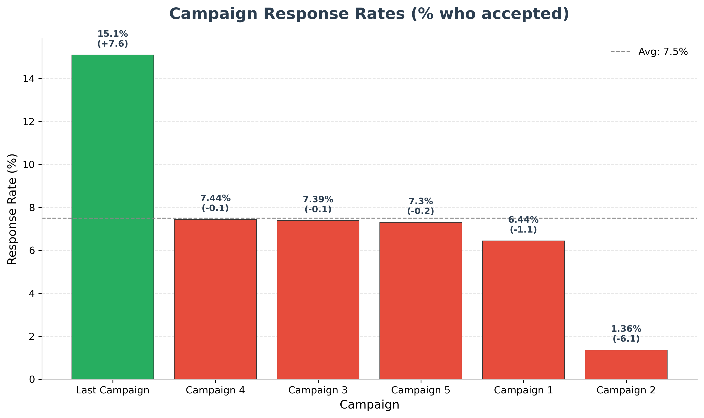
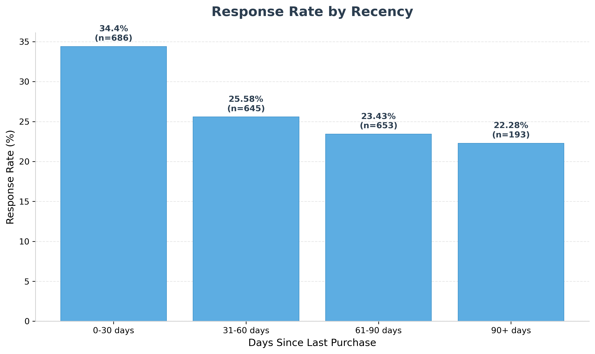

<div align="center">

# Customer Targeting & Campaign Effectiveness Analysis

**Python | MySQL | Pandas | Matplotlib | Seaborn | Excel**

Looked at 2,205 customers across 6 marketing campaigns to figure out who actually responds, which campaigns are worth repeating, and where the company is repeatedly targeting customers who never respond.

The whole point is to end up with one targeting decision table that tells a marketing team exactly who to go after, who to skip, and which campaign to use.


[](https://colab.research.google.com/github/analytics-ak/marketing-campaign-roi-analysis/blob/main/marketing_campaign_analysis.ipynb)
[](https://mybinder.org/v2/gh/analytics-ak/marketing-campaign-roi-analysis/main?labpath=marketing_campaign_analysis.ipynb)

</div>

---

## Problem Statement

Most marketing campaigns go out to everyone. Some people respond; most don't. But nobody goes back and asks — who exactly responded? What do they look like? And how much money did we waste on people who were never going to respond?

This project answers one question:

**Which customers should we target, and which campaigns are actually worth repeating?**

---

## Why This Matters

- Stops wasting campaign budget on customers who never respond
- Tells the team exactly which segments to focus on and which to drop
- Turns raw customer data into a decision a marketing manager can use today

---

## Pipeline

```
MySQL (segmentation + response rates) → Python (profiling + waste detection) → Excel (decision table)
```

MySQL does the heavy lifting on numbers. Python digs deeper into patterns. Excel is what the marketing team actually opens and uses.

---

## The Dataset

- **Source:** [Kaggle — Marketing Campaign Results](https://www.kaggle.com/datasets/jackdaoud/marketing-data)
- **Rows:** 2,205 customers
- **Columns:** 39 (demographics, spending, campaign responses, purchase channels)
- **Note:** Small dataset — any conclusions here should be validated on larger data before making big budget moves

Each row is one customer with income, age, what they spend on across 6 product categories, how they responded to 6 different campaigns, and which channels they buy through.

---

## Key Findings

### 1. Income appears to be the strongest targeting signal in this dataset

High-income customers respond 3x more than low-income ones. Age barely moves the needle.

| Income Group | Customers | Response Rate |
|--------------|-----------|---------------|
| High (>65K)  | 667       | **44.68%** |
| Mid (35-65K) | 989       | 23.05% |
| Low (<35K)   | 549       | 14.21% |

Breaking it down further by age shows that within each income group, age has a small effect — but income is what really matters.

| Segment | Customers | Response Rate |
|---------|-----------|---------------|
| Young + High Income | 73 | **50.68%** |
| Senior + High Income | 276 | 44.93% |
| Middle + High Income | 318 | 43.08% |
| Senior + Mid Income | 393 | 24.94% |
| Middle + Mid Income | 552 | 22.10% |
| Young + Mid Income | 44 | 18.18% |
| Middle + Low Income | 345 | 16.52% |
| Young + Low Income | 102 | 11.76% |
| Senior + Low Income | 102 | 8.82% |

The Young + High Income segment has the highest response rate at 50.7%, but only 73 customers — small sample. The other two high-income segments (276 and 318 customers) are more reliable.

---

### 2. One Campaign Crushed Everything, One Was Basically Dead

Last Campaign pulled in 15.1% response rate — double the average. Campaign 2 barely got anyone to respond.



| Campaign | Response Rate | Lift vs Average |
|----------|---------------|------------------|
| Last Campaign | **15.10%** | +7.6 |
| Campaign 4 | 7.44% | -0.1 |
| Campaign 3 | 7.39% | -0.1 |
| Campaign 5 | 7.30% | -0.2 |
| Campaign 1 | 6.44% | -1.1 |
| Campaign 2 | 1.36% | -6.1 |

The gap between best and worst is almost 14 percentage points. If the budget is limited, scale Last Campaign and Campaign 2 show very low response and may not be worth scaling further.

---

### 3. 72.6% of Campaign Attempts Are Wasted

1,601 customers — 72.6% of the entire base — never responded to any of the 6 campaigns. That's 9,606 out of 13,230 total campaign attempts going to people who don't convert.

These aren't all worthless customers either. Their average income is $47.8K, and their average spend is $422. They're buying — just not through campaigns.

---

### 4. Recency is a Useful Filter

Customers who have purchased recently respond more. The pattern is consistent — as recency goes up, response rate drops.



| Recency | Customers | Response Rate |
|---------|-----------|---------------|
| 0-30 days | 686 | **34.40%** |
| 31-60 days | 645 | 25.58% |
| 61-90 days | 653 | 23.43% |
| 90+ days | 193 | 22.28% |

Actionable cutoff — prioritise customers with recency under 60 days. They respond at 25-34%, well above the 22-23% rate for older customers.

---

### 5. Responders Buy Differently

Responders spend more than double what non-responders spend ($937 vs $422) and earn 30% more ($62K vs $48K). They also use catalogue purchases at 2x the rate of non-responders.

| Metric | Responders | Non-Responders |
|--------|------------|----------------|
| Avg Income | $61,719 | $47,813 |
| Avg Total Spend | $937 | $422 |
| Avg Catalog Purchases | 4.13 | 2.08 |
| Avg Web Purchases | 5.08 | 3.73 |
| Avg Store Purchases | 6.60 | 5.53 |
| Avg Recency | 44 days | 51 days |
| Avg Web Visits/Month | 5.06 | 5.44 |

One thing stands out — non-responders actually visit the website more often (5.44 vs 5.06). They browse but don't buy. Either the campaigns aren't reaching them through the right channel, or the offers don't match what they want.

---

### 6. 501 High-Value Customers Are Being Ignored

501 customers who spend above average ($1,032), earn $68K, but never responded to a single campaign. That's 31% of all non-responders.

These people are spending money — the campaigns just aren't reaching them the right way. This suggests a targeting gap rather than a lack of customer value.

---

## The Targeting Decision Table

Every segment is classified as Target, Test, or Avoid based on thresholds pulled from the data distribution (Target > 34%, Avoid < 23%, Test in between).

| Income | Age | Customers | Response % | Avg Spend | Best Campaign | Action |
|--------|-----|-----------|------------|-----------|---------------|--------|
| High (>65K) | Young (<35) | 73 | 50.68% | $1,359 | Campaign 5 | **TARGET** |
| High (>65K) | Senior (>55) | 276 | 44.93% | $1,192 | Last Campaign | **TARGET** |
| High (>65K) | Middle (35-55) | 318 | 43.08% | $1,218 | Last Campaign | **TARGET** |
| Mid (35-65K) | Senior (>55) | 393 | 24.94% | $450 | Last Campaign | TEST |
| Mid (35-65K) | Middle (35-55) | 552 | 22.10% | $353 | Last Campaign | AVOID |
| Mid (35-65K) | Young (<35) | 44 | 18.18% | $419 | Last Campaign | AVOID |
| Low (<35K) | Middle (35-55) | 345 | 16.52% | $63 | Last Campaign | AVOID |
| Low (<35K) | Young (<35) | 102 | 11.76% | $53 | Campaign 3 | AVOID |
| Low (<35K) | Senior (>55) | 102 | 8.82% | $77 | Last Campaign | AVOID |

This is the deliverable. A marketing team can open this, sort it, and make decisions the same day.

---

## Recommendations

**1. Target high-income customers with Last Campaign**
All three high-income segments respond at 43-51%. Last Campaign is the best performer at 15.1%. Focus budget here — this is where the return is.

**2. Stop wasting on low-income segments**
Low-income customers respond at 9-17% regardless of age. 72.6% of campaign attempts currently go to people who never respond. Cutting spend on low-response segments frees up budget for the ones that work.

**3. Test mid-income seniors separately**
Mid-income seniors respond at 25% — borderline. They're worth a small test with Last Campaign before committing the full budget. Don't group them with other mid-income segments that sit at 18-22%.

**4. Prioritise recent customers**
Customers who purchased in the last 30 days respond at 34.4% — 12 points higher than those at 90+ days. Add recency as a secondary filter on top of income-based targeting.

---

## Conclusion

The targeting answer is simple — go after high-income customers using Last Campaign. They respond at 43-51% while low-income segments sit at 9-17%. Right now, 72.6% of campaign attempts are going to people who never respond. That is the largest inefficiency visible in the data.

Add recency as a filter. Customers who bought in the last 30 days respond at 34%, nearly double the 90+ day group.

Simple rule: high income + recent purchase + Last Campaign. That's where the return is.

---

## Limitations

- **2,205 customers are small.** These patterns should be validated on larger data before making major budget decisions.
- **Response is not a purchase.** A customer accepting a campaign doesn't mean they bought something. No revenue data is available to confirm actual ROI.
- **No campaign content or timing data.** We know which campaigns worked, but not why — the creative, the offer, and the timing are all unknown.
- **No control group.** We can't measure true campaign lift because there's no group that wasn't targeted at all.
- **Single time snapshot.** No way to track if response behaviour changes over time or across seasons.

---

## Tools & Libraries

| Tool | Used For |
|------|----------|
| Python | Data cleaning, feature engineering, analysis |
| MySQL | Database queries — segmentation, response rates, aggregation |
| Pandas | Data manipulation and grouping |
| Matplotlib & Seaborn | Charts and visualizations |
| openpyxl | Excel export with formatting and embedded charts |
| Jupyter Notebook | Full end-to-end analysis |

---

## Project Structure

```
marketing-campaign-roi-analysis/
│
├── marketing_campaign_analysis.ipynb     # Full analysis notebook
├── targeting_recommendations.xlsx        # Excel deliverable (3 sheets + chart)
├── README.md
│
├── sql/
│   └── queries.sql                        # All SQL queries standalone
│
└── images/
    ├── campaign_effectiveness.png
    └── recency_vs_response.png
```

---

## How to Run This Project

1. Clone this repo
   ```bash
   git clone https://github.com/analytics-ak/marketing-campaign-roi-analysis.git
   ```

2. Install the required libraries
   ```bash
   pip install pandas numpy matplotlib seaborn mysql-connector-python sqlalchemy openpyxl
   ```

3. Set up MySQL
   - Make sure MySQL is running locally
   - Update the connection credentials in the notebook (host, user, password)

4. Open the notebook
   ```bash
   jupyter notebook marketing_campaign_analysis.ipynb
   ```

5. Run all cells — charts will generate, data will load into MySQL, and the Excel file will be exported automatically

---

## Profile & Dataset

* 🔗 **LinkedIn:** [View My Profile](https://www.linkedin.com/in/analytics-ashish/)
* 📂 **Dataset:** [Marketing Campaign Results on Kaggle](https://www.kaggle.com/datasets/jackdaoud/marketing-data)
* 💻 **GitHub Repository:** [Marketing Campaign ROI Analysis](https://github.com/analytics-ak/marketing-campaign-roi-analysis)
* 📘 **Notebook:** [marketing_campaign_analysis.ipynb](https://github.com/analytics-ak/marketing-campaign-roi-analysis/blob/main/marketing_campaign_analysis.ipynb)

<br>

## Author

**Ashish Kumar Dongre**
Data Analyst

- Python | SQL | Data Analysis | Excel
- Focus: **Business-driven data insights**
